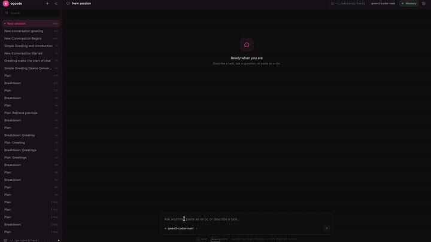

# Ogcode

[](https://discord.gg/JQP9t8y2Zv)


An agentic coding assistant with a web UI, written in Go.

Ogcode acts as a pair programmer that actually codes with you. It doesn't just suggest snippets; it understands your entire codebase, plans complex features, and executes them by creating branches and PRs automatically. It can even run multiple tasks in parallel across different branches, allowing you to ship entire features in a fraction of the time. Whether you're hunting a bug or building a zero-to-one feature, Ogcode handles the heavy lifting so you can focus on the architecture.

Ogcode gives you two ways to work with AI on your codebase:

- **Build Mode** — Chat directly with an AI agent that can read, write, edit, and execute code in your project.
- **Plan Mode** — Collaboratively plan a feature or refactor with a read-only planning agent, then break the plan into tasks. Each task gets its own git branch and an isolated agent session. Completed tasks auto-create pull requests. Multiple tasks can run in parallel, drastically speeding up complex feature implementations.

---

## Roadmap

- [ ] **Advanced Task Planning & Parallel Execution**: Enhanced plan decomposition, allowing users to manually or automatically assign coding agents to tasks, with full parallel execution support.
- [ ] **AI Daily Standups**: Voice-enabled daily meetings where all agents assigned to a project can report progress and discuss their work. This includes natural voice interactions, project-specific memory, and the ability to take and remember human feedback.
- [ ] **Ogland Integration**: A dedicated space within Ogcode to connect external services like Slack, Email, Jira, and more, enabling their use during the planning phase.
- [ ] **Agentic Deployment**: Full end-to-end agentic deployment support for all major cloud providers, starting with AWS.

---

## Agentic Session Memory 🧠



Ogcode's **Agentic Session Memory** revolutionizes how AI coding assistants handle context in long-running sessions. Instead of sending the entire conversation history to the LLM (which quickly becomes expensive and hits token limits), Ogcode intelligently extracts, stores, and retrieves only the relevant context needed for each query.

### Key Benefits

| Feature | Impact |
|---------|--------|
| **~70% Token Savings** | Drastically reduced API costs on long sessions |
| **Infinite Context** | No practical limit on session length or codebase size |
| **Higher Accuracy** | Only relevant memories are retrieved per query |

### Enable Agentic Memory

```bash
export OGCODE_AGENTIC_MEMORY_MODE=true
```

### Token Savings Example

| Session Length | Traditional | With Agentic Memory | Savings |
|----------------|-------------|---------------------|---------|
| 50 messages | ~25K tokens | ~8K tokens | **68%** |
| 200 messages | ~100K tokens | ~28K tokens | **72%** |
| 1000 messages | ~500K tokens | ~120K tokens | **76%** |

*Actual savings vary based on codebase complexity and conversation patterns.*

---

## Installation

### macOS / Linux

**Via Homebrew:**

```bash
brew tap prasenjeet-symon/ogcode
brew install ogcode
```

**Via curl:**

```bash
curl -fsSL http://ogcode.xyz/install.sh | sh
```

The installer auto-detects your platform, downloads the latest release, and installs to `/usr/local/bin` (uses `sudo` if needed).

### Windows

```powershell
irm http://ogcode.xyz/install.ps1 | iex
```

This downloads the latest release, extracts it to `%LOCALAPPDATA%\ogcode`, and adds it to your PATH automatically.

**Via winget (after next release):**

```powershell
winget install prasenjeet-symon.ogcode
```

**Manual install:**

1. Go to the [releases page](https://github.com/prasenjeet-symon/ogcode/releases) and download `ogcode_Windows_x86_64.zip` (or `_arm64.zip` if you have an ARM device).
2. Extract the zip file to a folder (e.g. `C:\Tools\ogcode`).
3. Add that folder to your `Path` environment variable:
   - Press `Win + S`, search for **Edit environment variables for your account**
   - Under **User variables**, find `Path` and click **Edit**
   - Click **New** and add the path to your ogcode folder (e.g. `C:\Tools\ogcode`)
   - Click **OK** on all dialogs
4. Open a new PowerShell or Command Prompt and run:

```powershell
ogcode version
```

### Go Install

```bash
go install github.com/prasenjeet-symon/ogcode@latest
```

### Docker

```bash
docker run -p 8080:8080 -v $(pwd):/workspace -w /workspace ghcr.io/prasenjeet-symon/ogcode:latest
```

---

## Configuration

Ogcode auto-detects available AI providers based on environment variables. No config files are required.

### Required: AI Provider

Set at least one API key (or use Ollama):

| Variable | Provider |
|----------|----------|
| `ANTHROPIC_API_KEY` | Anthropic (Claude) |
| `OPENAI_API_KEY` | OpenAI (GPT) |
| `OPENROUTER_API_KEY` | OpenRouter |
| `OLLAMA_API_KEY` | Ollama Cloud (see below) |
| `OLLAMA_BASE_URL` | Ollama (local / cloud URL) |

#### Ollama (local models)

Ogcode auto-detects Ollama on macOS/Linux if the binary is installed at a common path. On Windows, or if you have a non-standard install, set `OLLAMA_BASE_URL` explicitly.

**Local setup (default):**

```bash
# macOS / Linux — auto-detected if ollama is installed
ollama serve
ogcode

# Or be explicit on any OS:
export OLLAMA_BASE_URL=http://localhost:11434/v1
ogcode
```

On Windows (PowerShell):

```powershell
$env:OLLAMA_BASE_URL = "http://localhost:11434/v1"
ogcode
```

**Remote or Ollama Cloud:**

```bash
export OLLAMA_BASE_URL=https://api.ollama.com/v1   # or your custom endpoint
export OLLAMA_API_KEY=your-api-key                  # required for cloud / authenticated endpoints
ogcode
```

On Windows (PowerShell):

```powershell
$env:OLLAMA_BASE_URL = "https://api.ollama.com/v1"
$env:OLLAMA_API_KEY = "your-api-key"
ogcode
```

**Set a default model:**

```bash
export OLLAMA_MODEL=codellama   # defaults to qwen3-coder-next if not set
```

Available models in the UI include: `qwen3`, `codellama`, `llama3.1`, `deepseek-coder-v2`, `mistral`, and others. Any model you have pulled in Ollama will work — just select it from the model dropdown in the web UI.

### Optional: Agentic Memory

To give the agent long-term memory across sessions, set:

```bash
export OGCODE_AGENTIC_MEMORY_MODE=true
```

This connects to an MCP-compatible memory server (configure via `MCP_SERVER_*` env vars).

### Optional: Custom Models

You can add custom models (e.g. fine-tuned endpoints) through the web UI at **Settings → Models**.

---

## Usage

### Start in Build Mode (default)

```bash
ogcode
```

Opens the web UI at `http://localhost:8080`. Chat with the agent, ask it to read files, write code, run commands, or search the codebase.

### Start in Plan Mode

```bash
ogcode plan
```

Opens the planning interface. Describe what you want to build. The planning agent will understand your codebase and discuss the approach with you. When you are satisfied, click **Lock Plan** — the agent breaks it into tasks with dependencies, effort, and complexity estimates.

### Use a custom port

```bash
ogcode -p 3000
ogcode plan -p 3000
```

### Check version

```bash
ogcode version
```

---

## The Plan Mode Workflow

1. **Describe** — Open a new plan and describe your goal. The planning agent reads your codebase and helps refine the approach.
2. **Lock** — When ready, lock the plan. The agent generates a structured task breakdown.
3. **Review** — View tasks in the Kanban board. Each task has a title, description, effort (S/M/L/XL), complexity, and dependencies.
4. **Execute** — Start tasks. Each one gets its own git branch and an isolated agent session. You can watch the agent work in real time.
5. **Complete** — When a task finishes, the agent commits its changes and a pull request is automatically created. Ogcode manages dependencies between tasks and runs independent tasks in parallel.
6. **Retry** — If a task fails, retry it. The stale branch is removed and the task starts fresh.

Plans are archived as markdown files in `.ogcode/archives/` once all tasks are completed.

---

## Community

Join the Ogcode community on Discord for discussions, support, and updates:

[](https://discord.gg/JQP9t8y2Zv)

- Ask questions and get help
- Share feedback and feature ideas
- Stay up to date with releases and announcements

---

## License

MIT License — see [LICENSE](LICENSE) for details.
