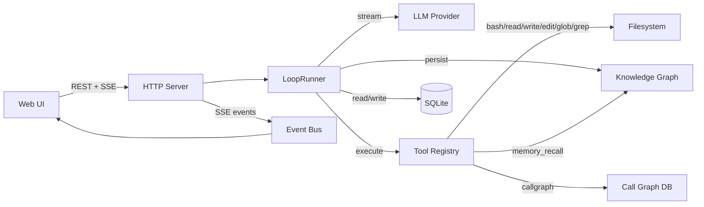
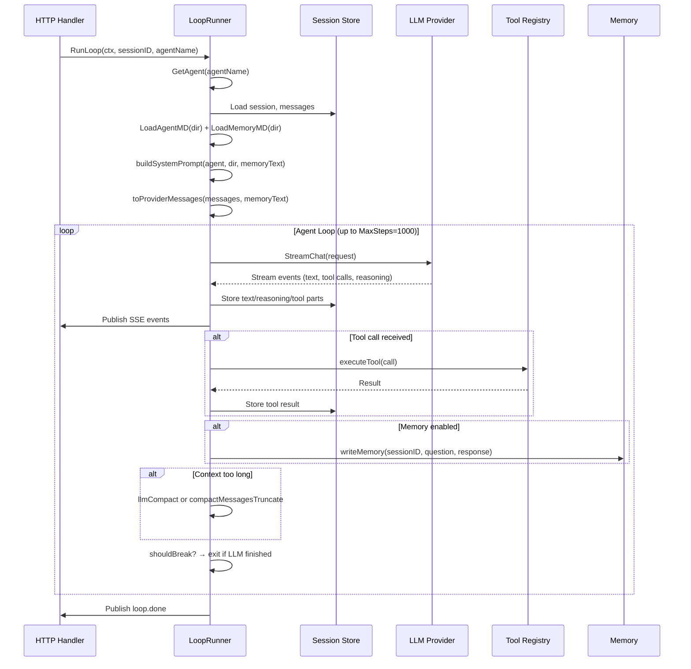
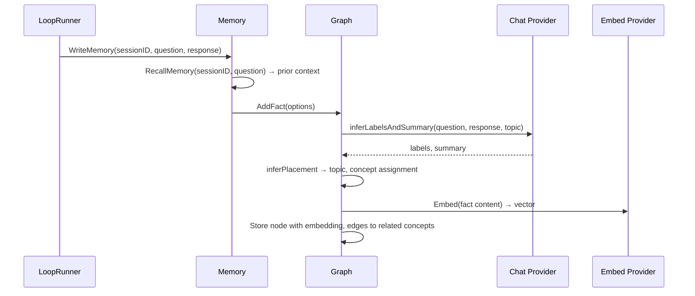
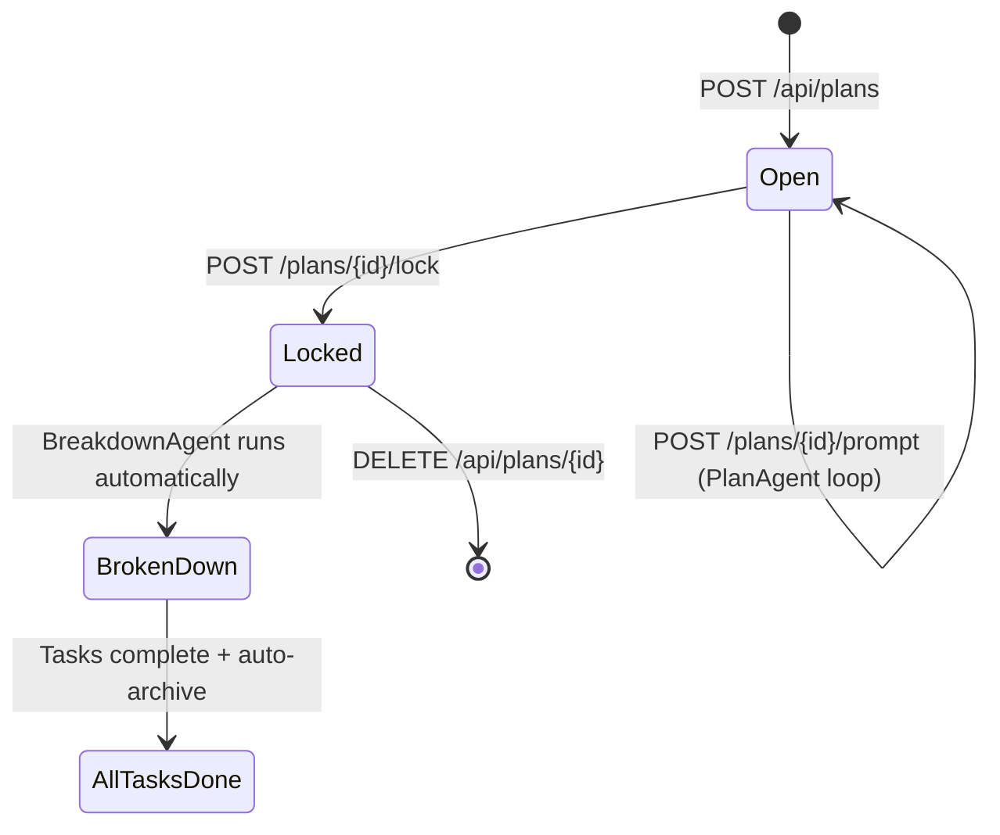
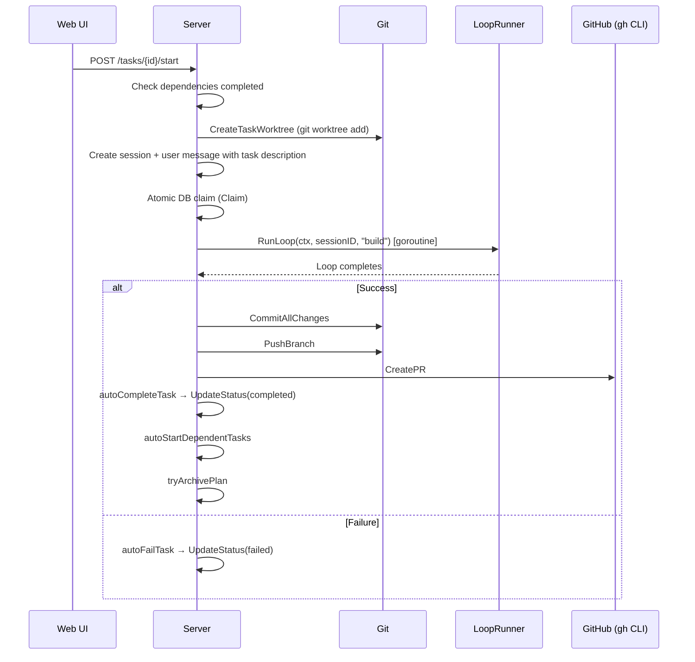
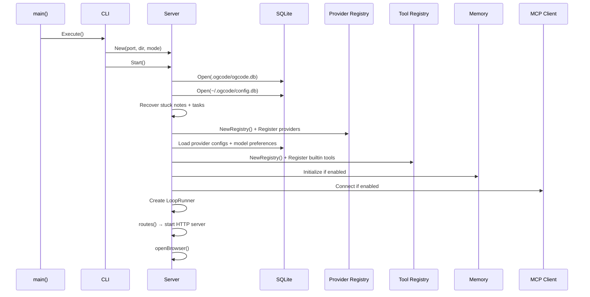

# Ogcode — Documentation Outline

> Auto-generated from codebase analysis and call graph traversal.

---

## 1. Overview & Quick Start

### 1.1 What is Ogcode?
- Agentic coding assistant with web UI, written in Go
- Two primary modes: **Build** (full read/write) and **Plan** (read-only planning → task breakdown → automated PRs)
- Single binary, single command to start

### 1.2 Quick Start
- Installation options: `go install`, Homebrew, curl script, Docker
- First run: `ogcode` or `ogcode serve` starts on port 8080
- Required env vars: at least one LLM API key (`ANTHROPIC_API_KEY`, `OPENAI_API_KEY`, `OPENROUTER_API_KEY`, or Ollama)
- Optional: `OGCODE_AGENTIC_MEMORY_MODE=true` + embed config for infinite-context memory

### 1.3 Architecture at a Glance
- Single Go binary: HTTP server + embedded React frontend
- Two databases: workspace DB (`.ogcode/ogcode.db`) + global config (`~/.ogcode/config.db`)
- Optional memory DB (`~/.ogcode/memory.db`) for agentic knowledge graph
- LLM providers: Anthropic, OpenAI, OpenRouter, Ollama



---

## 2. CLI & Configuration

### 2.1 Commands
| Command | Description | Flags |
|---------|-------------|-------|
| `ogcode` | Start in Build Mode (default) | `-p, --port` (default 8080) |
| `ogcode serve` | Same as default | `-p, --port` |
| `ogcode plan` | Start in Plan Mode | `-p, --port` |
| `ogcode version` | Print version info | — |

Entry point: `main.go` → `cli.Execute()` → `cli.serve()` → `server.New()` → `Server.Start()`

### 2.2 Environment Variables
| Variable | Purpose |
|----------|---------|
| `ANTHROPIC_API_KEY` | Anthropic provider key |
| `OPENAI_API_KEY` | OpenAI provider key |
| `OPENAI_BASE_URL` | Custom OpenAI base URL |
| `OPENROUTER_API_KEY` | OpenRouter provider key |
| `OLLAMA_BASE_URL` | Ollama base URL |
| `OLLAMA_API_KEY` | Ollama API key |
| `OGCODE_AGENTIC_MEMORY_MODE` | Enable agentic memory (`true`) |
| `OGCODE_EMBED_PROVIDER` | Embedding provider for memory |
| `OGCODE_EMBED_MODEL` | Embedding model for memory |
| `OGCODE_MCP_ENABLED` | Enable MCP tool server (`true`) |
| `OGCODE_MCP_COMMAND` | MCP server command |
| `OGCODE_MCP_ARGS` | MCP server args |
| `OGCODE_LOG_LEVEL` | Log level: `debug`, `info`, `warn`, `error` |
| `OGCODE_LOG_FORMAT` | Log format: `text` (default), `json` |

---

## 3. Agent System

### 3.1 Agent Definitions

Each agent is a static configuration with an ID, available tools, and a detailed system prompt:

| Agent | ID | Tools | System Prompt Focus |
|-------|----|-------|---------------------|
| **BuildAgent** | `build` | `bash, read, write, edit, glob, grep, memory_recall, callgraph` | Implement tasks with full read/write. Follow task description precisely. Build call graph, commit changes. |
| **PlanAgent** | `plan` | `bash, read, glob, grep, memory_recall, callgraph` | Read-only exploration. Produce structured implementation plans. Never write code. |
| **BreakdownAgent** | `breakdown` | `bash, read, glob, grep, submit_task_breakdown` | Transform locked plan into structured task definitions with dependencies. |
| **NoteAgent** | `note` | `bash, read, glob, grep` | Research a query and produce a comprehensive markdown note. Read-only. |

Resolution: `GetAgent(name)` defaults unknown names to BuildAgent.

### 3.2 Agent Loop (`LoopRunner.RunLoop`)

The core execution engine in `internal/agent/loop.go`:



Key subroutines:
- **`buildSystemPrompt()`**: Assembles agent directive + AGENT.md + MEMORY.md + tool descriptions + MCP tool definitions
- **`toProviderMessages()`**: Converts session messages to provider format, injecting memory context as a system message
- **`executeTool()`**: Resolves tool from registry, validates agent has access via `Agent.HasTool()`, runs built-in or MCP tool
- **`writeMemory()`**: Reads existing memory context, persists conversation turn to knowledge graph via `Memory.WriteMemory()`
- **`shouldBreak()`**: Checks if last assistant message has no pending tool calls (loop termination condition)

### 3.3 Context Compaction

When `isContextLengthError()` detects token limit:
1. **LLM compaction** (`llmCompact`): Asks the LLM to summarize older messages, injects summary as system addendum
2. **Truncation fallback** (`compactMessagesTruncate`): Keeps system prompt + most recent exchanges, drops older messages
3. Compaction summary is stored on the session for future reference

### 3.4 AGENT.md & MEMORY.md Discovery

- **`LoadAgentMD(dir)`**: Walks from `dir` up to filesystem root, aggregates all `AGENT.md` files
- **`LoadMemoryMD(dir)`**: Same pattern for `MEMORY.md` files
- Deeper (project-specific) files override root-level ones

---

## 4. Agentic Memory (`internal/memory/`)

### 4.1 Knowledge Graph Structure

```
Topic → Concept → Fact
```

Three-level hierarchy stored in SQLite:
- **Topic**: High-level category (e.g., "Ogcode Documentation")
- **Concept**: Sub-topic within a topic (e.g., "Agent System")
- **Fact**: Individual knowledge unit with labels, summary, and embedding vector

### 4.2 Write Flow (`Memory.WriteMemory`)



### 4.3 Read Flow (`Memory.ReadMemory`)

1. `Graph.BuildLightweightTree()`: Retrieves hierarchy using cosine similarity against session embeddings
2. `LightweightTreeAsText()`: Formats tree for prompt injection as `<prior_context>` block
3. Injected into system prompt by `toProviderMessages()`

### 4.4 Recall Flow (`Memory.RecallMemory`)

1. `Graph.Recall()`: Takes a specific question, builds lightweight tree, runs embedding search
2. Uses multi-round LLM reasoning (`buildRecallPrompt` → `chatClient.Chat`) to synthesize relevant facts
3. Returns a `RecallResult` with relevant facts and reasoning

### 4.5 Configuration

Two paths:
1. **Environment variable**: `OGCODE_AGENTIC_MEMORY_MODE=true` + `OGCODE_EMBED_PROVIDER` + `OGCODE_EMBED_MODEL`
2. **Database config**: Settings UI stores in `~/.ogcode/config.db` memory_config table

Embedding providers: OpenAI (`text-embedding-3-small`), OpenRouter, or Ollama (`nomic-embed-text`)
Chat provider for label/placement inference: defaults to the session's chat provider; can be configured separately.

---

## 5. Plan & Task System

### 5.1 Plans (`internal/plan/plan.go`)

A Plan is a collaborative conversation between the user and the PlanAgent:

| Field | Description |
|-------|-------------|
| `Status` | `open` → `locked` (finalized, no more messages) |
| `BreakdownStatus` | `""` → `in_progress` → `completed` or `failed` |
| `SessionID` | Links to a plan-type session for message history |
| `AllTasksCompleted` | Derived: true when locked and all tasks done |
| `ArchivedAt` | Set when all tasks complete; markdown file written to `.ogcode/archives/` |

### 5.2 Plan Lifecycle



**Lock flow** (`handleLockPlan`):
1. Cancels any running plan loop
2. Runs `generateFinalPlanSummary()`: injects a finalization prompt into the plan session, runs the PlanAgent loop synchronously with 3-minute timeout
3. Sets plan status to `locked`
4. Triggers `runBreakdown()` in background

### 5.3 Breakdown Process (`runBreakdown`)

1. Loads plan messages, constructs breakdown prompt with archive paths
2. Creates a new "build"-type session for the BreakdownAgent
3. Runs `LoopRunner.RunLoop(ctx, sessionID, "breakdown")` with 10-minute timeout
4. Parses response via `submit_task_breakdown` tool call or free-text JSON fallback
5. Validates for circular dependencies (`breakdownHasCycle`)
6. Creates Task records, assigns chain branches for dependency chains
7. Updates plan breakdown status to `completed` (or `failed`)

### 5.4 Tasks (`internal/task/task.go`)

| Field | Description |
|-------|-------------|
| `Status` | `pending` → `in_progress` → `completed` or `failed` |
| `Effort` | `S`, `M`, `L`, `XL` |
| `Complexity` | `low`, `medium`, `high` |
| `Dependencies` | 0-based task ID references; at most one dep per task (linear chains only) |
| `ChainBranch` | Shared branch for dependency chains (stacked PRs) |
| `BranchName` | Git branch for this task (e.g., `task/<id>-<slug>`) |
| `WorktreePath` | Path to git worktree under `.ogcode/worktrees/` |
| `PRURL` | URL of auto-created pull request |
| `PRError` | Error message if PR creation failed |

### 5.5 Task Execution Flow (`executeTask`)



### 5.6 Stacked PRs & Chain Branches

- **Chain branch**: When tasks form a dependency chain (A → B → C), they share a `chain/<planID>-<slug>` branch
- **MergeTaskBranch**: Completing a chain task merges its branch into the chain branch
- **Chain tail PR**: When the last task in a chain completes, one combined PR is opened for the entire chain
- **Standalone tasks**: Independent tasks get their own branch and individual PR

### 5.7 Plan Archival

When all tasks in a locked plan complete:
- `tryArchivePlan()` generates a markdown summary (plan summary + task outcomes)
- Writes to `<project>/.ogcode/archives/<slug>-<planID>.md`
- Sets `archivedAt` timestamp in DB
- These archive files are passed to the BreakdownAgent for context on subsequent plans

---

## 6. LLM Providers (`internal/provider/`)

### 6.1 Provider Interface

```go
type Provider interface {
    ID() string
    Models() []ModelInfo
    StreamChat(ctx context.Context, req StreamRequest) (<-chan StreamEvent, error)
}
```

**Optional interfaces**:
- `Embedder`: `Embed(ctx, inputs) ([][]float32, error)` + `EmbedModel() string`
- `ModelRefresher`: `RefreshModels()`

### 6.2 Supported Providers

| Provider | ID | Streaming | Embeddings | Config |
|----------|----|-----------|------------|--------|
| Anthropic | `anthropic` | ✅ | ❌ | `ANTHROPIC_API_KEY` |
| OpenAI | `openai` | ✅ | ✅ | `OPENAI_API_KEY`, `OPENAI_BASE_URL` |
| OpenRouter | `openrouter` | ✅ | ✅ | `OPENROUTER_API_KEY` |
| Ollama | `ollama` | ✅ | ✅ | `OLLAMA_BASE_URL`, `OLLAMA_API_KEY` |

### 6.3 Provider Resolution (`Registry.ResolveProvider`)

1. Check custom model routing (`customModels` map)
2. Check built-in model IDs
3. Fall back to first registered provider

### 6.4 Model Catalog

- Each provider has a static model list (`Models()`)
- Cloud providers (`isCloudURL`) dynamically fetch from `/v1/models` endpoint
- Custom models can be added via `POST /api/models/preference` with `isCustom: true`
- Provider priority for default selection: Anthropic → OpenAI → OpenRouter → Ollama

### 6.5 Stream Events (`provider.StreamEvent`)

| Type | Description |
|------|-------------|
| `text-delta` | Incremental text content |
| `tool-call-start` | Beginning of a tool call (name + call ID) |
| `tool-call-delta` | Incremental JSON input for tool call |
| `tool-call-end` | Tool call input complete |
| `reasoning` | Extended thinking/reasoning content |
| `finish` | Stream complete (finish_reason) |
| `usage` | Token usage statistics |
| `error` | Stream error |

---

## 7. Built-in Tools (`internal/tool/`)

### 7.1 Tool Interface

```go
type ToolDef interface {
    ID() string
    Description() string
    Parameters() json.RawMessage
    Execute(ctx context.Context, args json.RawMessage, tctx Context) (Result, error)
}
```

`Context` carries: `SessionID`, `MessageID`, `Agent`, `CallID`, `Context`, `SessionDir`, `Ask` (permission request), `Metadata` (display update).

`Result` carries: `Title`, `Metadata`, `Output`.

### 7.2 Tool Registry

`NewRegistry()` registers all built-in tools. MCP tools are added dynamically when `OGCODE_MCP_ENABLED=true`.

`ForAgent(toolIDs)` filters tools to those available for a given agent. `ToProviderTools()` converts for LLM function calling format.

### 7.3 Built-in Tools

| Tool | ID | Key Features |
|------|----|-------------|
| `BashTool` | `bash` | Execute shell commands, supports working directory and timeout |
| `ReadTool` | `read` | Read file/directory contents, line offset + limit |
| `WriteTool` | `write` | Write content to files, create if not exists |
| `EditTool` | `edit` | Search-and-replace edit, validates unique match |
| `GlobTool` | `glob` | Find files matching glob patterns |
| `GrepTool` | `grep` | Search file contents by regex |
| `MemoryRecallTool` | `memory_recall` | Semantic recall from knowledge graph |
| `BreakdownTool` | `submit_task_breakdown` | Submit structured task breakdown (used by BreakdownAgent) |
| `CallGraphTool` | `callgraph` | Build and query persistent call graph |

### 7.4 Call Graph Tool (Detailed)

Actions: `stats`, `nodes`, `edges`, `callees`, `callers`, `reachable`, `upsert_node`, `add_nodes_batch`, `add_edge`, `add_edges_batch`, `delete_nodes_by_file`, `clear`.

Stored in workspace DB via `internal/callgraph/store.go`. The doc field on nodes captures *semantic meaning* — what a function does, how it relates to other nodes, and why it exists.

### 7.5 Permission System (`internal/permission/`)

Default ruleset for BuildAgent:
- `read` → Allow
- `glob` → Allow
- `grep` → Allow
- `bash` → Ask
- `write` → Ask
- `edit` → Ask

Users can approve "once" or "always" via the permission dialog (streamed over SSE).

---

## 8. Session System (`internal/session/`)

### 8.1 Data Model

| Entity | ID Prefix | Purpose |
|--------|-----------|---------|
| Session | `ses_` | Agent conversation (build/plan/note type) |
| Message | `msg_` | Single message in a session (user/assistant role) |
| Part | `prt_` | Content part within a message (text/tool/reasoning) |
| Permission | `prm_` | Permission request/response |

### 8.2 Message Parts

Each message has multiple parts, each with a type:
- **Text**: `{ "text": "..." }`
- **Tool**: `{ "tool": "bash", "callId": "...", "state": { "status": "pending|running|done|error", ... }, "input": ..., "output": ... }`
- **Reasoning**: Extended thinking content from reasoning models

### 8.3 Session Types

| Type | Description |
|------|-------------|
| `build` | Standard BuildAgent session |
| `plan` | PlanAgent session (linked to a Plan entity) |
| `note` | NoteAgent session (linked to a Note entity) |

### 8.4 Message Pagination

`GetMessages(sessionID, before, limit)` returns the most recent N messages in chronological order. The `before` parameter enables cursor-based pagination.

---

## 9. REST API (`internal/server/routes.go`)

### 9.1 Route Map

| Method | Path | Handler | Description |
|--------|------|---------|-------------|
| **Sessions** ||||
| GET | `/api/session` | `handleListSessions` | List sessions by directory |
| POST | `/api/session` | `handleCreateSession` | Create new session |
| GET | `/api/session/{sessionID}` | `handleGetSession` | Get session by ID |
| PATCH | `/api/session/{sessionID}` | `handleUpdateSession` | Update session (title, model, permission) |
| DELETE | `/api/session/{sessionID}` | `handleDeleteSession` | Delete session + cancel loop + finalize note |
| POST | `/api/session/{sessionID}/abort` | `handleAbortSession` | Cancel running loop + mark messages aborted |
| POST | `/api/session/{sessionID}/prompt` | `handlePrompt` | Send user message + start agent loop |
| GET | `/api/session/{sessionID}/message` | `handleGetMessages` | Get messages (paginated) |
| POST | `/api/session/{sessionID}/permission/{permissionID}` | `handlePermissionReply` | Reply to permission request |
| **Plans** ||||
| GET | `/api/plans` | `handleListPlans` | List plans by directory |
| POST | `/api/plans` | `handleCreatePlan` | Create plan + session |
| GET | `/api/plans/{planID}` | `handleGetPlan` | Get plan by ID |
| PATCH | `/api/plans/{planID}` | `handleUpdatePlan` | Update plan (title, model) |
| DELETE | `/api/plans/{planID}` | `handleDeletePlan` | Delete plan + cleanup worktrees |
| POST | `/api/plans/{planID}/lock` | `handleLockPlan` | Lock plan → generate summary → run breakdown |
| POST | `/api/plans/{planID}/abort` | `handleAbortPlan` | Cancel running plan loop |
| POST | `/api/plans/{planID}/prompt` | `handlePlanPrompt` | Send message to PlanAgent |
| GET | `/api/plans/{planID}/message` | `handleGetPlanMessages` | Get plan session messages |
| GET | `/api/plans/{planID}/export` | `handleExportPlan` | Export plan as markdown |
| POST | `/api/plans/{planID}/tasks` | `handleCreateTasks` | Create tasks for a plan |
| GET | `/api/plans/{planID}/tasks` | `handleListTasks` | List tasks for a plan |
| **Tasks** ||||
| GET | `/api/tasks/{taskID}` | `handleGetTask` | Get task by ID |
| PATCH | `/api/tasks/{taskID}` | `handleUpdateTask` | Update task fields |
| POST | `/api/tasks/{taskID}/start` | `handleStartTask` | Start task execution (create worktree, session, run agent) |
| POST | `/api/tasks/{taskID}/complete` | `handleCompleteTask` | Complete task + push + create PR |
| POST | `/api/tasks/{taskID}/fail` | `handleFailTask` | Fail task + cleanup worktree |
| POST | `/api/tasks/{taskID}/retry` | `handleRetryTask` | Reset failed task + re-execute |
| **Notes** ||||
| GET | `/api/notes` | `handleListNotes` | List notes by directory |
| POST | `/api/notes` | `handleCreateNote` | Create note + start NoteAgent session |
| GET | `/api/notes/{noteID}` | `handleGetNote` | Get note by ID |
| DELETE | `/api/notes/{noteID}` | `handleDeleteNote` | Delete note |
| GET | `/api/notes/{noteID}/versions` | `handleListNoteVersions` | List note versions |
| GET | `/api/notes/{noteID}/export` | `handleExportNote` | Export note as markdown file |
| **Memory** ||||
| GET | `/api/memory/config` | `handleGetMemoryConfig` | Get memory config (masked API keys) |
| POST | `/api/memory/config` | `handleSetMemoryConfig` | Set memory config |
| GET | `/api/memory/models` | `handleMemoryModels` | Get available models for memory |
| **Providers** ||||
| GET | `/api/providers/config` | `handleGetProviderConfigs` | Get all provider configs |
| POST | `/api/providers/config/{id}` | `handleSetProviderConfig` | Set provider config (API key, base URL) |
| **Models** ||||
| GET | `/api/models` | `handleModels` | List available models |
| POST | `/api/models/refresh` | `handleModelsRefresh` | Refresh model catalog from providers |
| POST | `/api/models/preference` | `handleSetModelPreference` | Set model preference |
| DELETE | `/api/models/preference/{id}` | `handleDeleteModelPreference` | Delete model preference |
| **Theme** ||||
| GET | `/api/theme` | `handleGetTheme` | Get theme settings |
| POST | `/api/theme` | `handleSetTheme` | Set theme |
| DELETE | `/api/theme/{directory}` | `handleDeleteTheme` | Delete theme |
| **Real-time** ||||
| GET | `/api/event` | `handleEvent` | SSE stream (all bus events) |
| **Other** ||||
| GET | `/api/path` | `handlePath` | Get server working directory |
| GET | `/api/agent` | `handleAgents` | List agent definitions |
| GET | `/api/config` | `handleConfig` | Get server config |
| GET | `/api/mode` | `handleMode` | Get server mode (build/plan) |
| GET | `/api/vcs` | `handleVCS` | Get VCS (git) status |
| GET | `/api/version` | `handleVersion` | Get version info |
| POST | `/api/version/check` | `handleVersionCheck` | Check for updates |
| GET | `/api/pricing` | `handleGetPricing` | Get model pricing info |

### 9.2 Event Bus Types

All events are published over SSE at `/api/event`:

| Event Type | Properties |
|------------|-----------|
| `session.created` | Session object |
| `session.updated` | Session object |
| `session.deleted` | `{ id }` |
| `message.updated` | MessageInfo object |
| `message.part.updated` | `{ sessionId, partId }` |
| `plan.created` | Plan object |
| `plan.updated` | Plan object |
| `plan.locked` | Plan object |
| `plan.deleted` | `{ id }` |
| `plan.breakdown.started` | `{ planId }` |
| `plan.breakdown.completed` | `{ planId, count, warnings }` |
| `plan.breakdown.failed` | `{ planId, reason }` |
| `plan.archived` | `{ planId, path }` |
| `task.created` | `{ planId, count }` |
| `task.started` | Task object |
| `task.completed` | Task object |
| `task.failed` | Task object |
| `task.retried` | Task object |
| `note.created` | Note object |
| `note.updated` | `{ sessionId }` |
| `note.deleted` | `{ id }` |
| `loop.done` | `{ sessionId, reason }` |

---

## 10. Data Storage

### 10.1 Database Schema (SQLite + goose migrations)

| Migration | Tables Added/Modified |
|-----------|----------------------|
| 001 | Sessions, messages, parts, permissions |
| 002 | `model` column on sessions |
| 003 | Model preferences table |
| 004 | Theme table |
| 005 | Compaction summary on sessions |
| 006 | Plans and tasks tables |
| 007 | `session_type` column (build/plan/note) |
| 008 | `breakdown_status` on plans |
| 009 | `worktree_path` on tasks |
| 010 | `breakdown_warnings` on plans |
| 011 | `pr_error` on tasks |
| 012 | Memory config table |
| 013 | Provider config table |
| 014 | `memory_tokens_saved` on sessions |
| 015 | `chain_branch` on tasks |
| 016 | `archived_at` on plans |
| 017 | Notes table |
| 018 | Note versions table |

### 10.2 Key ID Formats (ULID-based)

| Entity | Prefix | Example |
|--------|--------|---------|
| Session | `ses_` | `ses_01JX2K3M...` |
| Message | `msg_` | `msg_01JX2K3M...` |
| Part | `prt_` | `prt_01JX2K3M...` |
| Permission | `prm_` | `prm_01JX2K3M...` |
| Plan | `pln_` | `pln_01JX2K3M...` |
| Task | `tsk_` | `tsk_01JX2K3M...` |
| Note | `nte_` | `nte_01JX2K3M...` |

---

## 11. Git Worktree Management (`internal/git/`)

### 11.1 Core Operations

| Function | Description |
|----------|-------------|
| `CreateTaskWorktree(repoDir, taskID, slug, baseBranch)` | Creates `.ogcode/worktrees/<branch>`, configures local git identity |
| `RemoveTaskWorktree(repoDir, branchName)` | Removes worktree + deletes local branch |
| `RemoveTaskWorktreeKeepBranch(repoDir, branchName)` | Removes worktree directory only (keeps branch for local access) |
| `CreateChainBranch(repoDir, chainBranch)` | Creates shared branch for stacked PRs |
| `MergeTaskBranch(repoDir, chainBranch, taskBranch, title)` | Merges task branch into chain branch |
| `CommitAllChanges(worktreeDir, msg)` | `git add -A && git commit -m msg` with local identity |
| `PushBranch(ctx, repoDir, branchName)` | Push to origin (no-op if no remote) |
| `CreatePR(ctx, repoDir, branch, title, body, base)` | Create PR via `gh` CLI (idempotent) |
| `Slugify(title)` | Convert task title to URL-safe slug (max 40 chars) |

### 11.2 Worktree Layout

```
<repo>/
├── .git/
├── .ogcode/
│   ├── ogcode.db          # Workspace database
│   ├── config.db           # Global config (in ~)
│   ├── worktrees/
│   │   ├── task/<taskID>-<slug>/   # Task worktrees
│   │   └── ...
│   ├── archives/           # Archived plan markdown files
│   │   └── <slug>-<planID>.md
│   └── notes/              # Note markdown files
│       └── <noteID>.md
```

---

## 12. Server Initialization (`Server.Start`)



---

## 13. Version & Update Checking (`internal/version/`)

- Current version: **v0.3.0** (set via ldflags)
- `CheckUpdate()`: Fetches latest release from GitHub API (`prasenjeet-symon/ogcode`), caches for 1 hour
- Detects install method: Homebrew, winget, scoop, cargo, or curl script
- Compares semantic versions and returns update info with install command
- `IsDev()`: Returns true for `dev` or empty version strings

---

## 14. MCP Integration (`internal/mcp/`)

- Enabled via `OGCODE_MCP_ENABLED=true`
- Spawns an external process (default: `ogden mcp`) as MCP server
- Discovers tools dynamically via MCP protocol
- MCP tools are dispatched through the same `Registry.ForAgent()` mechanism
- Tools are added to agent system prompts at `buildSystemPrompt()` time

---

## 15. Note System (`internal/note/`)

### 15.1 Lifecycle

1. User creates a note with a query → `POST /api/notes`
2. Server creates a "note"-type session + Note record (status: `generating`)
3. NoteAgent runs via `RunLoop(ctx, sessionID, "note")`
4. On loop exit, defer captures final assistant message → `noteStore.FinalizeBySession()`
5. Status transitions: `generating` → `done` or `error`
6. Stuck notes from server crashes are recovered on startup

### 15.2 Note Versioning

Each re-research of the same query creates a new version. `NoteVersion` records track the history.

### 15.3 Persistence

Notes are saved to `.ogcode/notes/<noteID>.md` as markdown files, enabling the NoteAgent to reference them via the `read` tool.

---

## 16. Key Design Decisions

1. **Single binary**: Go backend + embedded React frontend via `web/embed.go`
2. **Two-database strategy**: Workspace DB for project data, global config DB for settings that persist across projects
3. **Git worktrees for isolation**: Each task gets its own worktree so multiple agents can work in parallel without conflicts
4. **Atomic task claiming**: `taskStore.Claim()` uses database-level concurrency control to prevent double-starts
5. **Serial git operations**: `gitMu` mutex serializes all `git worktree add/remove/prune` calls to prevent `.git/config` corruption
6. **Auto-start dependencies**: After a task completes, `autoStartDependentTasks()` automatically begins tasks whose dependencies are all done
7. **Stacked PRs**: Chain branches enable sequential tasks to share work, with a single PR opened for the entire chain
8. **Breakdown safety**: `breakdownHasCycle()` validates task dependency graph is a DAG before creating tasks
9. **Context compaction**: LLM-based summarization as primary strategy with truncation as fallback
10. **Permission system**: User approval required for destructive tools (bash, write, edit); read-only tools auto-approved